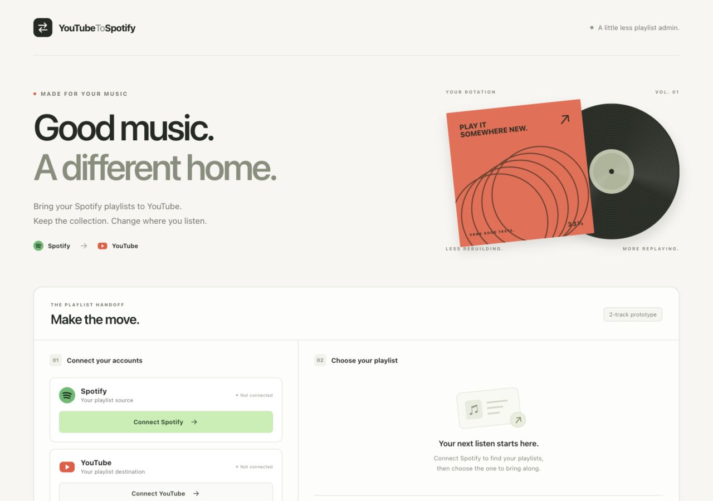

<div align="center">

# YouTubeToSpotify

**Your playlists. Another place to press play.**

A playlist-transfer prototype built with React, Node.js, and Express.

[](https://github.com/vig-star/YouTubeToSpotify/actions/workflows/ci.yml)


[Local setup](#local-setup) · [How it works](#how-it-works) · [Project notes](#project-notes)



</div>

## About

YouTubeToSpotify explores moving playlists between music platforms through a small React interface and an Express API. Connect your accounts, select a playlist, and use the existing conversion action.

**Current implementation:** Spotify → YouTube, copying the **first two tracks** of a selected playlist. The repository retains its original name; YouTube → Spotify conversion is not implemented. This is a local prototype with legacy API compatibility limitations, described below.

## Local setup

Use **Node.js 22.9 or newer** and npm (Node 22 is pinned in `.nvmrc`). If you use nvm, run `nvm use` from the repository root.

1. **Clone and install both packages.**

   ```bash
   git clone https://github.com/vig-star/YouTubeToSpotify.git
   cd YouTubeToSpotify
   npm ci
   npm ci --prefix client
   ```

2. **Create your local configuration.**

   ```bash
   cp .env.example .env
   ```

   Fill in `.env` with your own Spotify app credentials, Google OAuth web-client credentials, and a YouTube Data API v3 key. `npm start` loads this file; it is excluded from Git.

   | Provider | Configuration | Authorized redirect URI |
   | --- | --- | --- |
   | [Spotify Developer Dashboard](https://developer.spotify.com/dashboard) | Client ID and client secret | `http://127.0.0.1:8000/callback` |
   | [Google Cloud Console](https://console.cloud.google.com/) | OAuth web client ID and secret; enable YouTube Data API v3 and create an API key | `http://127.0.0.1:8000/callbackGoogle` |

   Configure the Google OAuth consent screen and add your account as a test user when the app is in testing. Keep the registered redirects and `.env` values identical. Use `127.0.0.1` consistently: Spotify no longer accepts `localhost` redirect URIs. See [Spotify's redirect requirements](https://developer.spotify.com/documentation/web-api/concepts/redirect_uri) and [Google's web-server OAuth guide](https://developers.google.com/identity/protocols/oauth2/web-server).

3. **Start the API in one terminal.**

   ```bash
   npm start
   ```

   The API listens on port **8000**.

4. **Start the interface in a second terminal.**

   ```bash
   npm run client
   ```

   Open **[http://127.0.0.1:3000](http://127.0.0.1:3000)**. The interface can be viewed without credentials; account actions require provider configuration and compatible API access.

## How it works

1. Connect Spotify and YouTube using the account buttons.
2. Open **Spotify playlists** and choose a playlist containing at least two tracks.
3. Use the conversion button to create a YouTube playlist with the same name. The prototype searches YouTube by track title and adds the first search result for each of the first two tracks.

Conversion writes to your connected YouTube account. Matching is approximate, and a repeated conversion creates another playlist.

## Development

Run these commands from the repository root:

| Command | Purpose |
| --- | --- |
| `npm start` | Start Express with local environment settings |
| `npm run client` | Start the React development server |
| `npm test -- --runInBand` | Run the interface smoke test once |
| `npm run build` | Build the interface into `client/build/` |

The project keeps its original React 17 / Create React App 4 stack. Start and build scripts enable Node's legacy OpenSSL provider for compatibility with its Webpack 4 toolchain. Dependencies have not been migrated as part of the presentation cleanup.

```text
client/
  public/          App icon and browser metadata
  src/             React interface and styles
server/
  config.js        Environment-backed settings and existing token state
  routes/          OAuth, playlist lookup, and conversion endpoints
  server.js        Express entry point
docs/images/       Interface preview
.env.example       Credential configuration template
.github/           Automated checks and pull request template
```

## Project notes

- **Legacy Spotify API:** the server uses `/playlists/{id}/tracks` and the older `track` response field. Spotify's 2026 Development Mode changes replace these with `/items` and updated fields. Fresh Development Mode apps may not complete transfers without a separate API update. See the [official migration guide](https://developer.spotify.com/documentation/web-api/tutorials/february-2026-migration-guide).
- **Prototype limits:** two tracks per conversion, first-page playlist/track results, title-only matching, and no completed-transfer confirmation. Private Spotify playlist scopes are not requested.
- **Local use:** tokens are held in shared server memory; refresh, per-user sessions, and complete error handling are not implemented. The existing server is not suitable for a shared public deployment.
- **Credentials:** older Git history contains credentials. Rotate those keys and secrets in the provider dashboards before live use. Removing values from the current files does not remove them from history.

## Contributing

See [CONTRIBUTING.md](CONTRIBUTING.md) for the local workflow. This repository preserves the original project history and contributors; the current polish focuses on presentation, documentation, and repository hygiene.
